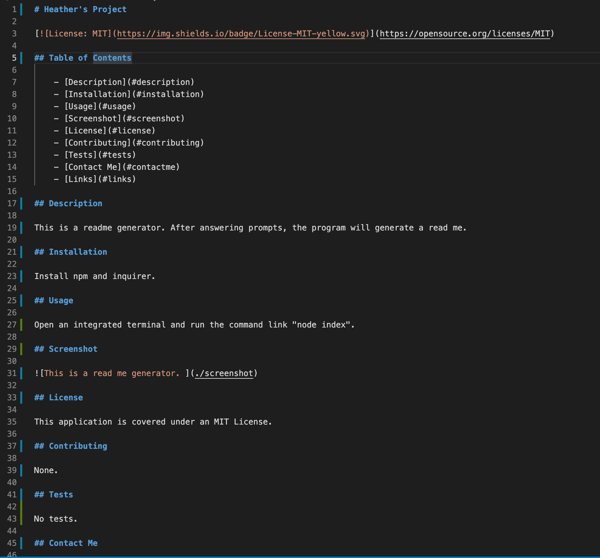
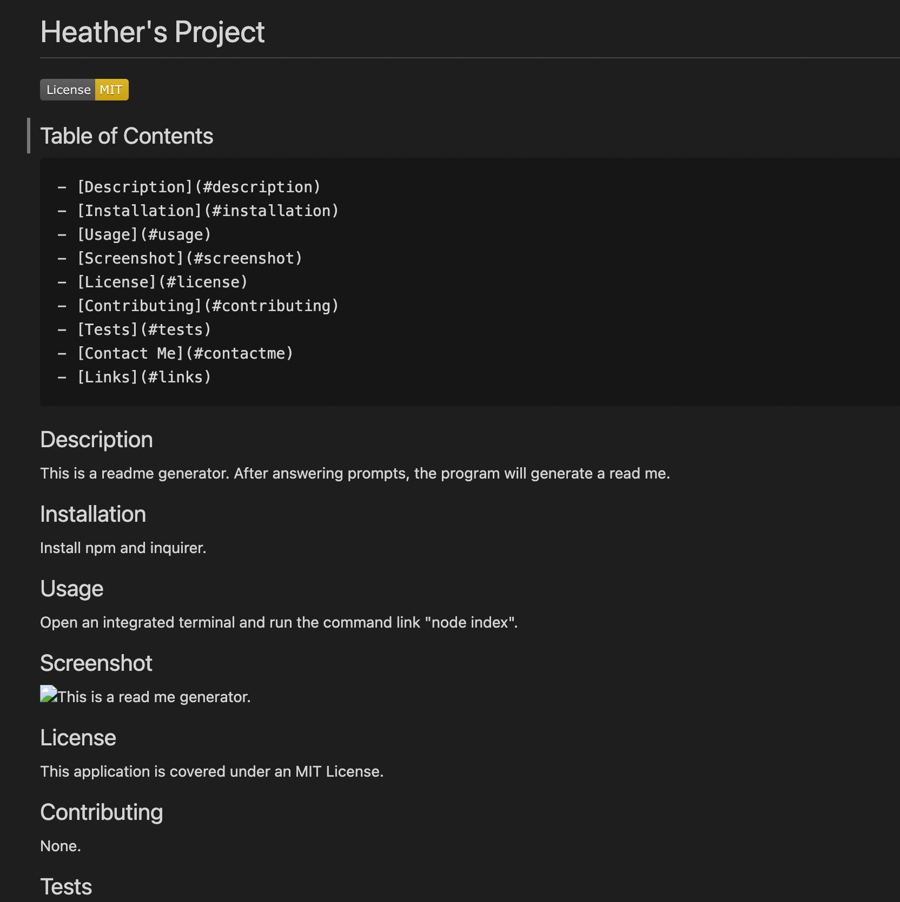

# README Generator

## Description

When the user opens a terminal in VS Cose and types "node index", they will see a series of answerable prompts. When they type or select answers from those prompts, the information is pushed to a high quality, organized README file.

The prompts request information for the following sections: Description, Installation, Usage, License, Contributing, Tests, and Contact Me.

The title of the project is displayed in large text and the section headings are in medium text to make the file readable and well organized. The information input by the user is filed under the appropriate section headings.

If the user wants to include a license, they can choose from a dropdown menu of licenses. When selected, the license will be added as a badge near the top of the README and a description of the license will appear under the "License" section within the body of the README.

The user will be prompted to enter their contact information; GitHub username and email address, and that information will be stored under the "Contact Me" section of the README.

The Table of Contents is formatted to be clickable, so the reader can quickly skip to any section they'd like to.

## Installation

This README.md generator requires npm and inquirier to be installed.

### Screenshots

The following is a link to a Loom video walk through of this application.
https://www.loom.com/share/9b7b3307b94a4eee86a026941659b3cc

## License

This application is covered under an MIT license.

## Contact Me

    GitHub: https://github.com/heatherveva

    Email: heatherveva@gmail.com

## Links

    Here is a link to the repository: https://github.com/heatherveva/readme-generator.git

    Here is the page: https://heatherveva.github.io/readme-generator/
